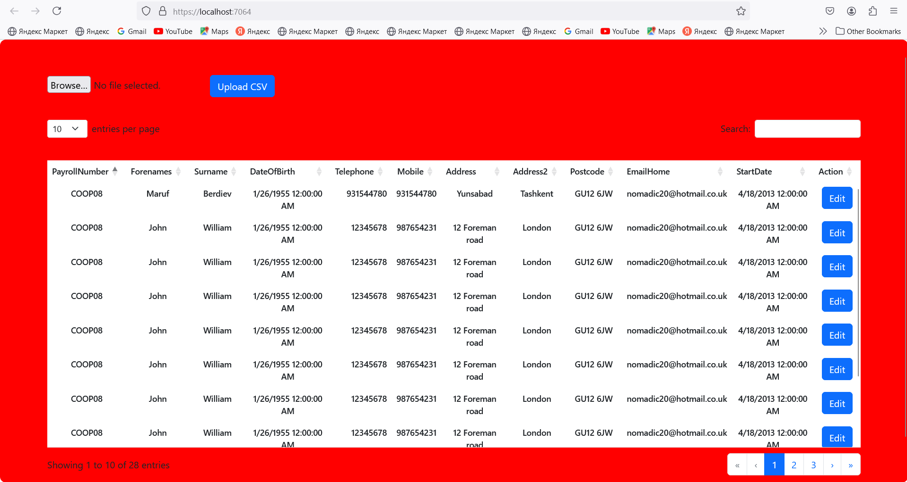
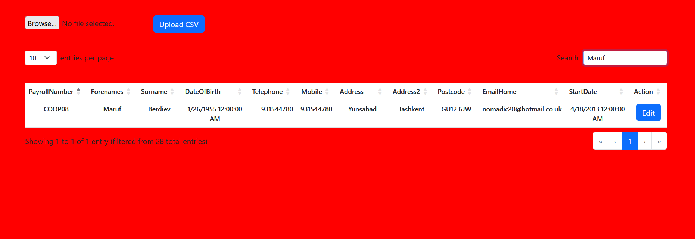
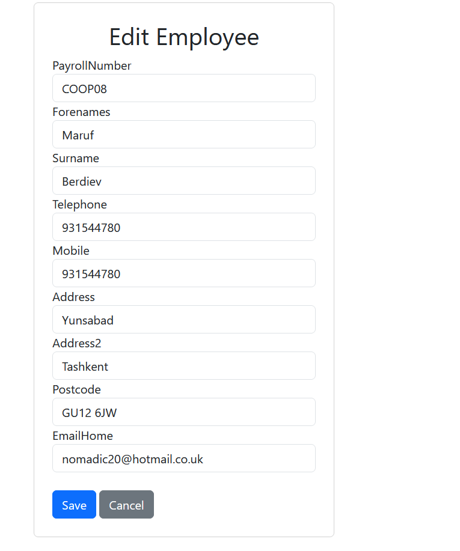

# TaskForSYNEL

This project is an employee management system built using ASP.NET Core 8 MVC. It supports CRUD operations and allows for importing employee records via CSV files, providing a user-friendly experience for managing employee data.

<div>
	<p><strong>This main page</strong>, </br>
	you can see all employee table and you can search,sort by employee propertities </br>
	and also you can do pagination and Edit any employee</p>
	
</div>
<div>
	<p><strong>Searchin by name</strong></p>
	
</div>
<div>
	<p><strong>Editing employee</strong></p>
	
</div>

## Technologies Used
- **Backend:** ASP.NET Core 8 (MVC)
- **CSV Parsing:** CsvHelper library
- **Database:** SQL Server
- **File Upload:** ASP.NET IFormFile

## Prerequisites
Before you begin, ensure you have the following installed:
- [.NET Core SDK 8](https://dotnet.microsoft.com/download/dotnet/8.0)
- [SQL Server](https://www.microsoft.com/en-us/sql-server/sql-server-downloads)

## How to Run

Follow these steps to get your application up and running:

1. **Clone the repository:**
   ```bash
   git clone https://github.com/fuga002/TaskForSYNEL.git

## Database Setup
- **Command to Set Up Database:** Run the following command in your terminal to set up the database:
  ```bash
  dotnet ef database update


## Build and Run the Project
- **Command to Build and Run:** Finally, build and run your project using the following command:
  ```bash
  dotnet run

## Setup Instructions

### 1. Configure Database Connection

Open the `appsettings.json` file in your project and locate the connection string section. Update it to point to your SQL Server database. It should look something like this:

```json
{
  "ConnectionStrings": {
    "DefaultConnection": "Server=your_server;Database=your_database;User Id=your_username;Password=your_password;"
  }
}


